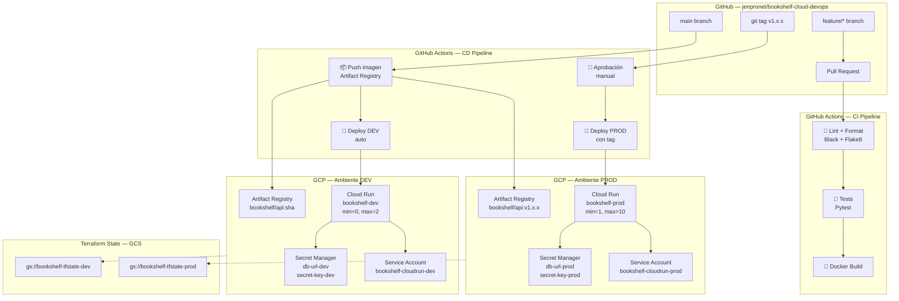

# 🏛️ Arquitectura GCP — BookShelf Cloud

Repositorio: jenpronet/bookshelf-cloud-devops

---

## Diagrama de Arquitectura



---

## Descripción de Componentes

### GitHub Actions (CI/CD)
El pipeline tiene tres momentos clave: en PR valida código, en push a `main` despliega a DEV automáticamente, y en tag/release despliega a PROD con aprobación manual.

### Artifact Registry
Repositorio centralizado de imágenes Docker dentro de GCP. Las imágenes de DEV se etiquetan con el SHA del commit; las de PROD con el tag SemVer (`v1.x.x`).

### Cloud Run
Servicio serverless que ejecuta los contenedores. DEV escala a cero (ahorra costos), PROD mantiene al menos 1 instancia activa para no tener cold starts.

### Secret Manager
Almacena credenciales sensibles (DATABASE_URL, SECRET_KEY). Cloud Run las inyecta como variables de entorno en tiempo de ejecución. Nunca se hardcodean en el código ni en Terraform.

### Service Accounts + IAM
Dos Service Accounts por ambiente con mínimo privilegio: una para Cloud Run (solo lee secretos e imágenes) y otra para GitHub Actions (solo publica imágenes y despliega).

### Backend GCS
El estado de Terraform se guarda en Cloud Storage con versionado, lo que permite trabajo en equipo y recuperación ante errores.

---

## Flujo de un Deploy

```
1. Developer abre PR desde feature/* → main
2. CI: lint + tests + docker build (automático)
3. Code review aprobado → merge a main
4. CD: build imagen → push a Artifact Registry → deploy a DEV (automático)
5. QA valida en DEV
6. Developer crea tag: git tag v1.x.x && git push origin v1.x.x
7. CD: solicita aprobación manual en GitHub Actions
8. Aprobador confirma → deploy a PROD
```
